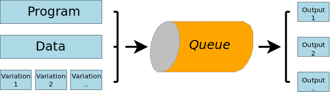

Colmo
=====

Colluding Morsels

A bunch of python scripts that work with [redis](http://redis.io/) to create a simple but effective distributed processing system. 

Sidenote: a [history](history.md) too short to be clicked 

Read following quick demonstration, and then read the [setup](setup.md) to get started. 

## Quick demonstration 

These are the actions undertaken on the client.

The python program we are going to run ('pattern_in_random.py') goes into a loop, and keeps on generating random numbers until it finds one that ends with a requested pattern. 

Eg. you want to get a random number that ends with 12345 

    $ ./pattern_in_random.py 12345
    result:43012345 after 54381 iterations

Of course the longer the pattern, the more iterations (and the longer) it takes to find a random number with the requested pattern. 
And if you are wondering what the use is of this program? Sorry, it's completely useless, it's just a simple way to literally waste time! 

Here's the source of that program:

    #!/usr/bin/python 

    import sys
    import random

    if len(sys.argv)<2:
        print "Usage: %s pattern " % sys.argv[0]
        print "   eg. %s 7777 " % sys.argv[0]
        sys.exit(1)

    pattern=sys.argv[1]
    cnt=0
    random.seed()
    go_on=True
    while go_on:
        s=str.format("{0}",random.randrange(0,100000000))
        if s.endswith(pattern):
            print "result:%s after %d iterations" % ( s, cnt )
            go_on=False
        cnt=cnt+1

Let's now run this program on our *Colmo cluster* ! (Just imagine it has already been setup.)

Push the program and the three requested variations 11111, 33333, 55555 onto the job queue: 

    $ qjob.py pattern_in_random.py nodata 11111 33333 55555 

    Adding  job277
    Adding  job278
    Adding  job279

Immediately followed by a 'list-progress' command, to see what is going on:
 
    $ lsp.py 

    === PROGRESS ============== 
    --- QUEUE: qjob ------- 
    {id:job279, program:pattern_in_random.py, data:nodata, variation:55555, .. }
    {id:job278, program:pattern_in_random.py, data:nodata, variation:33333, .. }
    {id:job277, program:pattern_in_random.py, data:nodata, variation:11111, .. }
    --- SET: sprogress ------- 

Note: above json was slightly edited to make it more pallatable! 

A moment later, enquire again:

    $ lsp.py 

    === PROGRESS ============== 
    --- QUEUE: qjob ------- 
    --- SET: sprogress ------- 
    {id:job277, program:pattern_in_random.py, data:nodata, variation:11111, .. }

All jobs have left the queue, and two of them have already been processed, leaving only 1 job in the *progress* set. 

And again a little while later, the job queue and the progress set are empty. 

    $ lsp.py 

    === PROGRESS ============== 
    --- QUEUE: qjob ------- 
    --- SET: sprogress ------- 

Now show the output of the jobs:

    $ showo.py 

    --- MAP: moutput ------- 
    job277 : result:2011111 after 352711 iterations | 
    job278 : result:75133333 after 115120 iterations | 
    job279 : result:57555555 after 460 iterations | 
   
And that concludes the quick tour! 
 
